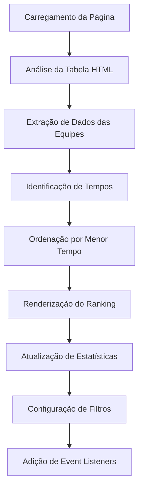

# 🏆 Ranking Buzz Line - Sistema de Classificação para Competições de Robôs

[](https://opensource.org/)
[](LICENSE)
[](https://github.com/seu-usuario/ranking-buzzline)
[](https://developer.mozilla.org/)
[](https://responsive.design/)

> **Sistema de ranking dinâmico e profissional para competições de robôs seguidores de linha, desenvolvido em parceria com a Cesar School para o Ôxe Maker 2025.**

## 📋 Índice

- [🎯 Sobre o Projeto](#-sobre-o-projeto)
- [✨ Funcionalidades](#-funcionalidades)
- [🛠️ Tecnologias](#️-tecnologias)
- [🚀 Instalação e Uso](#-instalação-e-uso)
- [📖 Como Funciona](#-como-funciona)
- [🎨 Design e UX](#-design-e-ux)
- [📊 API JavaScript](#-api-javascript)
- [⌨️ Atalhos de Teclado](#️-atalhos-de-teclado)
- [📱 Responsividade](#-responsividade)
- [♿ Acessibilidade](#-acessibilidade)
- [🔧 Configuração Avançada](#-configuração-avançada)
- [📚 Contexto do Evento](#-contexto-do-evento)
- [🤝 Contribuindo](#-contribuindo)
- [📄 Licença](#-licença)

---

## 🎯 Sobre o Projeto

O **Ranking Buzz Line** é um sistema web open source desenvolvido para automatizar e visualizar rankings de competições de robôs seguidores de linha. O projeto foi criado durante o **Ôxe Maker 2025** em parceria com a **Cesar School** e a **Secretaria de Educação**.

### 🎪 **Características Principais:**
- **Open Source**: Código livre e disponível para a comunidade
- **Tempo Real**: Atualizações dinâmicas do ranking
- **Responsivo**: Funciona perfeitamente em qualquer dispositivo
- **Acessível**: Desenvolvido seguindo padrões de acessibilidade
- **Customizável**: Fácil de adaptar para diferentes competições

---

## ✨ Funcionalidades

### 🎯 **Funcionalidades Core**
- ✅ **Ordenação Automática**: Ranking ordenado pelo menor tempo
- ✅ **Medalhas Visuais**: Destaque especial para top 3 (🥇🥈🥉)
- ✅ **Status Dinâmico**: Diferenciação entre equipes com/sem tempo
- ✅ **Top 10**: Exibição das melhores posições

### 🚀 **Funcionalidades Avançadas**
- 📊 **Dashboard de Estatísticas**: Métricas em tempo real
- 🔍 **Sistema de Filtros**: Visualizar todas, concluídas ou pendentes
- 🎨 **Design Moderno**: Interface profissional com animações
- 📱 **Totalmente Responsivo**: Adaptado para mobile, tablet e desktop
- ⌨️ **Atalhos de Teclado**: Navegação rápida e eficiente
- 📤 **Exportação de Dados**: Download em formato JSON
- 🎭 **Animações Suaves**: Transições e efeitos visuais
- ♿ **Acessibilidade**: Compatível com screen readers e navegação por teclado

### 🔧 **Funcionalidades Técnicas**
- **API JavaScript**: Interface programática para integração
- **Modularidade**: Código organizado e reutilizável
- **Performance**: Otimizado para carregamento rápido
- **Cross-browser**: Compatível com todos os navegadores modernos

---

## 🛠️ Tecnologias

### **Frontend**
- **HTML5**: Estrutura semântica e acessível
- **CSS3**: Design moderno com Flexbox/Grid e animações
- **JavaScript ES6+**: Lógica avançada e interatividade
- **Font Awesome**: Biblioteca de ícones profissionais
- **Google Fonts**: Tipografia moderna (Inter)

### **Características Técnicas**
- **Vanilla JavaScript**: Sem dependências externas
- **CSS Variables**: Sistema de cores centralizado
- **Responsive Design**: Mobile-first approach
- **Progressive Enhancement**: Funciona mesmo sem JavaScript

---

## 🚀 Instalação e Uso

### **📥 Download**
```bash
# Clone o repositório
git clone https://github.com/seu-usuario/ranking-buzzline.git

# Ou baixe o ZIP
wget https://github.com/seu-usuario/ranking-buzzline/archive/main.zip
```

### **⚡ Execução Rápida**
1. Baixe ou clone o projeto
2. Abra o arquivo `index.html` em qualquer navegador
3. O ranking será carregado automaticamente

### **🔧 Servidor Local (Recomendado)**
```bash
# Navegue até a pasta do projeto
cd ranking-buzzline

# Python 3
python -m http.server 8000

# Node.js (com http-server)
npx http-server

# PHP
php -S localhost:8000

# Live Server (VS Code)
# Instale a extensão Live Server e clique com botão direito no index.html
```

**Acesse**: `http://localhost:8000`

### **🌐 Deploy em Produção**
```bash
# GitHub Pages
git push origin main

# Netlify
netlify deploy --prod --dir .

# Vercel
vercel --prod

# Servidor Apache/Nginx
# Copie os arquivos para a pasta public_html
```

---

## 📖 Como Funciona

### **🔄 Fluxo de Funcionamento**



### **1. 📊 Carregamento de Dados**
```javascript
// O sistema analisa automaticamente a tabela HTML
const linhas = Array.from(rankingBody.querySelectorAll("tr"));

// Extrai informações de cada equipe
const equipes = linhas.map(tr => {
  const nome = tds[1].textContent.trim();
  const tempo = parseFloat(tds[2].textContent.trim());
  return { nome, tempo };
});
```

### **2. 🏆 Ordenação Inteligente**
```javascript
// Separa equipes com e sem tempo
const equipesComTempo = equipes.filter(e => e.tempo !== null);
const equipesSemTempo = equipes.filter(e => e.tempo === null);

// Ordena por menor tempo
equipesComTempo.sort((a, b) => a.tempo - b.tempo);

// Ranking final: com tempo primeiro, sem tempo depois
const rankingFinal = [...equipesComTempo, ...equipesSemTempo];
```

### **3. 🎨 Renderização Visual**
```javascript
// Aplica medalhas e cores especiais
rankingFinal.forEach((equipe, index) => {
  if (index === 0) tds[0].textContent = "🥇";
  else if (index === 1) tds[0].textContent = "🥈";
  else if (index === 2) tds[0].textContent = "🥉";
  
  // Adiciona classes CSS para destaque
  novaLinha.classList.add("top" + (index + 1));
});
```

### **4. 📈 Estatísticas em Tempo Real**
```javascript
// Calcula métricas automaticamente
const estatisticas = {
  totalEquipes: equipes.length,
  equipesComTempo: equipes.filter(e => e.tempo !== null).length,
  melhorTempo: Math.min(...tempos),
  tempoMedio: tempos.reduce((a, b) => a + b, 0) / tempos.length
};
```

---

## 🎨 Design e UX

### **🎨 Paleta de Cores - Cesar School**
```css
:root {
  --primary-color: #FF6B00;    /* Laranja Cesar */
  --secondary-color: #FF8C00;  /* Laranja Escuro */
  --accent-color: #FFA500;     /* Laranja Dourado */
  --success-color: #00C851;    /* Verde */
  --dark-bg: #1a1a1a;          /* Fundo Escuro */
  --card-bg: #2d2d2d;          /* Cards */
  --text-primary: #ffffff;     /* Texto Principal */
}
```

### **🌟 Características Visuais**
- **Gradientes Modernos**: Transições suaves entre cores
- **Animações CSS**: Efeitos de entrada e hover
- **Sombras Profundas**: Dimensão e profundidade
- **Tipografia Hierárquica**: Diferentes pesos e tamanhos
- **Espaçamento Consistente**: Grid system responsivo

### **🎭 Animações e Transições**
```css
/* Animação de entrada */
@keyframes fadeInUp {
  from { opacity: 0; transform: translateY(30px); }
  to { opacity: 1; transform: translateY(0); }
}

/* Efeito hover */
.stat-card:hover {
  transform: translateY(-5px);
  box-shadow: 0 15px 35px rgba(255, 107, 0, 0.4);
}
```

---

## 📊 API JavaScript

### **🔧 Interface Programática**

O sistema expõe uma API global `RankingBuzzLine` para integração e customização:

```javascript
// Adicionar nova equipe
RankingBuzzLine.adicionarEquipe("Nova Equipe", 25.5);

// Atualizar tempo de uma equipe existente
RankingBuzzLine.atualizarTempo("ODISSEIA", 18.5);

// Obter estatísticas completas
const stats = RankingBuzzLine.obterEstatisticas();
console.log(stats);
// Output: {
//   totalEquipes: 8,
//   equipesComTempo: 5,
//   melhorTempo: 20.92,
//   tempoMedio: 31.6
// }

// Exportar dados do ranking
RankingBuzzLine.exportarDados();

// Forçar reordenação do ranking
RankingBuzzLine.ordenarRanking();
```

### **📡 Eventos Customizáveis**
```javascript
// Escutar mudanças no ranking
document.addEventListener('ranking-updated', (event) => {
  console.log('Ranking atualizado:', event.detail);
});

// Escutar mudanças de filtro
document.addEventListener('filter-changed', (event) => {
  console.log('Filtro alterado para:', event.detail.filter);
});
```

---

## ⌨️ Atalhos de Teclado

| Atalho | Ação | Descrição |
|--------|------|-----------|
| `Ctrl + 1` | Mostrar todas as equipes | Remove filtros e mostra ranking completo |
| `Ctrl + 2` | Filtrar equipes com tempo | Mostra apenas equipes que já competiram |
| `Ctrl + 3` | Filtrar equipes pendentes | Mostra apenas equipes sem tempo registrado |
| `Ctrl + E` | Exportar dados | Baixa arquivo JSON com dados do ranking |
| `Tab` | Navegação por elementos | Move foco entre botões e elementos interativos |
| `Enter` | Ativar elemento | Ativa botão ou filtro em foco |

### **🎯 Dicas de Navegação**
- Use `Tab` para navegar entre elementos
- `Enter` ou `Espaço` para ativar botões
- `Esc` para sair de modais ou menus

---

## 📱 Responsividade

### **📐 Breakpoints**
```css
/* Desktop */
@media (min-width: 769px) { /* Layout completo */ }

/* Tablet */
@media (max-width: 768px) { /* Layout adaptado */ }

/* Mobile */
@media (max-width: 480px) { /* Layout otimizado */ }
```

### **📱 Adaptações por Dispositivo**

#### **Desktop (> 768px)**
- Layout em grid com múltiplas colunas
- Tabela completa com todas as informações
- Hover effects e animações completas

#### **Tablet (≤ 768px)**
- Estatísticas em coluna única
- Botões de filtro empilhados
- Tabela com scroll horizontal

#### **Mobile (≤ 480px)**
- Layout vertical otimizado
- Fonte e espaçamentos reduzidos
- Touch-friendly interface

---

## ♿ Acessibilidade

### **✅ Padrões Implementados**
- **WCAG 2.1 AA**: Conformidade com diretrizes internacionais
- **Semântica HTML**: Uso correto de tags e estrutura
- **Contraste de Cores**: Mínimo 4.5:1 para texto normal
- **Navegação por Teclado**: Todos os elementos acessíveis
- **Screen Readers**: Compatível com leitores de tela
- **Focus Management**: Estados de foco visíveis

### **🔧 Recursos de Acessibilidade**
```html
<!-- Estrutura semântica -->
<header role="banner">
  <h1>Ranking Buzz Line</h1>
</header>

<main role="main">
  <section aria-label="Estatísticas do evento">
    <!-- Conteúdo -->
  </section>
</main>

<!-- Navegação por teclado -->
<button aria-label="Filtrar equipes com tempo" tabindex="0">
  <i class="fas fa-check-circle" aria-hidden="true"></i>
  Com Tempo
</button>
```

### **🎨 Design Inclusivo**
- **Redução de Movimento**: Respeita `prefers-reduced-motion`
- **Alto Contraste**: Cores com contraste adequado
- **Tamanhos de Fonte**: Escaláveis e legíveis
- **Área de Toque**: Mínimo 44px para elementos interativos

---

## 🔧 Configuração Avançada

### **⚙️ Personalização de Cores**
```css
/* Edite as variáveis CSS para personalizar */
:root {
  --primary-color: #FF6B00;     /* Cor principal */
  --secondary-color: #FF8C00;   /* Cor secundária */
  --accent-color: #FFA500;      /* Cor de destaque */
  --success-color: #00C851;     /* Cor de sucesso */
  --dark-bg: #1a1a1a;           /* Fundo escuro */
  --card-bg: #2d2d2d;           /* Fundo dos cards */
}
```

### **📊 Adicionando Novas Equipes**
```html
<!-- Adicione novas linhas na tabela -->
<tbody id="rankingBody">
  <tr>
    <td></td>
    <td>NOVA EQUIPE</td>
    <td>25.5</td>
    <td><span class="status completed">Concluído</span></td>
  </tr>
</tbody>
```

### **🔌 Integração com APIs**
```javascript
// Exemplo de integração com API externa
async function sincronizarComAPI() {
  try {
    const response = await fetch('/api/ranking');
    const dados = await response.json();
    
    // Atualizar ranking com dados da API
    dados.equipes.forEach(equipe => {
      RankingBuzzLine.atualizarTempo(equipe.nome, equipe.tempo);
    });
  } catch (error) {
    console.error('Erro ao sincronizar:', error);
  }
}
```

### **📈 Sistema de Notificações**
```javascript
// Adicionar notificações personalizadas
function mostrarNotificacao(mensagem, tipo = 'info') {
  const notificacao = document.createElement('div');
  notificacao.className = `notificacao ${tipo}`;
  notificacao.textContent = mensagem;
  document.body.appendChild(notificacao);
  
  setTimeout(() => notificacao.remove(), 3000);
}
```

---

## 📚 Contexto do Evento

### **🎪 Ôxe Maker 2025**

O **Ôxe Maker 2025** é um evento de tecnologia, inovação e educação que reúne estudantes, professores e entusiastas para promover a aprendizagem prática em áreas como:

- **Robótica**: Construção e programação de robôs
- **Programação**: Desenvolvimento de software
- **Eletrônica**: Circuitos e componentes
- **Inovação**: Soluções criativas para problemas reais

### **🏁 Modalidade Buzz Line**

Na competição de **Buzz Line**, os robôs devem:
- Percorrer uma pista no menor tempo possível
- Seguir linhas e contornar obstáculos
- Demonstrar precisão e velocidade
- Competir em diferentes categorias

### **🏫 Parceria com Cesar School**

Este projeto foi desenvolvido em parceria com a **Cesar School**, instituição reconhecida por:
- **Inovação Educacional**: Metodologias modernas de ensino
- **Tecnologia**: Foco em áreas STEM (Science, Technology, Engineering, Mathematics)
- **Comunidade**: Engajamento com eventos educacionais
- **Identidade Visual**: Cores laranja que representam criatividade e energia

---

## 🤝 Contribuindo

### **🌟 Como Contribuir**

Este é um projeto **open source** e estamos abertos a contribuições da comunidade! Aqui estão as formas de contribuir:

#### **🐛 Reportar Bugs**
1. Verifique se o bug já foi reportado
2. Crie uma [issue](../../issues/new) com:
   - Descrição detalhada do problema
   - Passos para reproduzir
   - Screenshots (se aplicável)
   - Informações do navegador/dispositivo

#### **💡 Sugerir Funcionalidades**
1. Verifique se a funcionalidade já foi sugerida
2. Crie uma [issue](../../issues/new) com:
   - Descrição da funcionalidade
   - Casos de uso
   - Benefícios para a comunidade

#### **🔧 Contribuir com Código**
1. Faça um fork do projeto
2. Crie uma branch para sua feature: `git checkout -b feature/nova-funcionalidade`
3. Commit suas mudanças: `git commit -m 'Adiciona nova funcionalidade'`
4. Push para a branch: `git push origin feature/nova-funcionalidade`
5. Abra um [Pull Request](../../pulls)

#### **📖 Melhorar Documentação**
- Corrigir erros de português
- Adicionar exemplos de uso
- Melhorar explicações técnicas
- Traduzir para outros idiomas

### **📋 Padrões de Contribuição**

#### **Código**
- Use nomes descritivos para variáveis e funções
- Comente código complexo
- Mantenha consistência com o estilo existente
- Teste suas mudanças em diferentes navegadores

#### **Commits**
- Use mensagens claras e descritivas
- Formato: `tipo: descrição breve`
- Exemplos: `feat: adiciona sistema de filtros`, `fix: corrige bug na ordenação`

#### **Pull Requests**
- Descreva claramente as mudanças
- Inclua screenshots se houver mudanças visuais
- Referencie issues relacionadas
- Certifique-se que não há conflitos

### **🎯 Roadmap de Contribuições**

#### **Fácil para Iniciantes**
- [ ] Corrigir erros de português na documentação
- [ ] Adicionar mais atalhos de teclado
- [ ] Melhorar responsividade em dispositivos específicos
- [ ] Adicionar mais idiomas

#### **Intermediário**
- [ ] Implementar sistema de temas (claro/escuro)
- [ ] Adicionar gráficos de performance
- [ ] Melhorar sistema de notificações
- [ ] Implementar cache local

#### **Avançado**
- [ ] Integração com WebSockets para tempo real
- [ ] Sistema de autenticação para administradores
- [ ] API REST completa
- [ ] Progressive Web App (PWA)

---

## 📄 Licença

### **📜 Licença MIT**

Este projeto está licenciado sob a **Licença MIT** - veja o arquivo [LICENSE](LICENSE) para detalhes.

```
MIT License

Copyright (c) 2025 Ranking Buzz Line - Cesar School

Permission is hereby granted, free of charge, to any person obtaining a copy
of this software and associated documentation files (the "Software"), to deal
in the Software without restriction, including without limitation the rights
to use, copy, modify, merge, publish, distribute, sublicense, and/or sell
copies of the Software, and to permit persons to whom the Software is
furnished to do so, subject to the following conditions:

The above copyright notice and this permission notice shall be included in all
copies or substantial portions of the Software.

THE SOFTWARE IS PROVIDED "AS IS", WITHOUT WARRANTY OF ANY KIND, EXPRESS OR
IMPLIED, INCLUDING BUT NOT LIMITED TO THE WARRANTIES OF MERCHANTABILITY,
FITNESS FOR A PARTICULAR PURPOSE AND NONINFRINGEMENT. IN NO EVENT SHALL THE
AUTHORS OR COPYRIGHT HOLDERS BE LIABLE FOR ANY CLAIM, DAMAGES OR OTHER
LIABILITY, WHETHER IN AN ACTION OF CONTRACT, TORT OR OTHERWISE, ARISING FROM,
OUT OF OR IN CONNECTION WITH THE SOFTWARE OR THE USE OR OTHER DEALINGS IN THE
SOFTWARE.
```

### **🎯 O que isso significa?**

- ✅ **Uso Livre**: Pode usar em projetos pessoais e comerciais
- ✅ **Modificação**: Pode alterar e adaptar o código
- ✅ **Distribuição**: Pode compartilhar e redistribuir
- ✅ **Uso Privado**: Pode usar em projetos fechados
- ❌ **Sem Garantias**: Software fornecido "como está"

---

## 🙏 Agradecimentos

### **👥 Equipe de Desenvolvimento**
- **Desenvolvedor Principal**: [Seu Nome](https://github.com/seu-usuario)
- **Designer**: [Nome do Designer](https://github.com/designer)
- **Contribuidores**: [Lista de contribuidores](../../graphs/contributors)

### **🏫 Instituições Parceiras**
- **Cesar School**: Parceria e identidade visual
- **Secretaria de Educação**: Apoio ao evento
- **Ôxe Maker 2025**: Organização do evento

### **🛠️ Tecnologias e Bibliotecas**
- **Font Awesome**: Ícones profissionais
- **Google Fonts**: Tipografia moderna
- **MDN Web Docs**: Documentação de referência
- **W3C**: Padrões de acessibilidade

---

<div align="center">


**⭐ Se este projeto foi útil para você, considere dar uma estrela!**

</div>